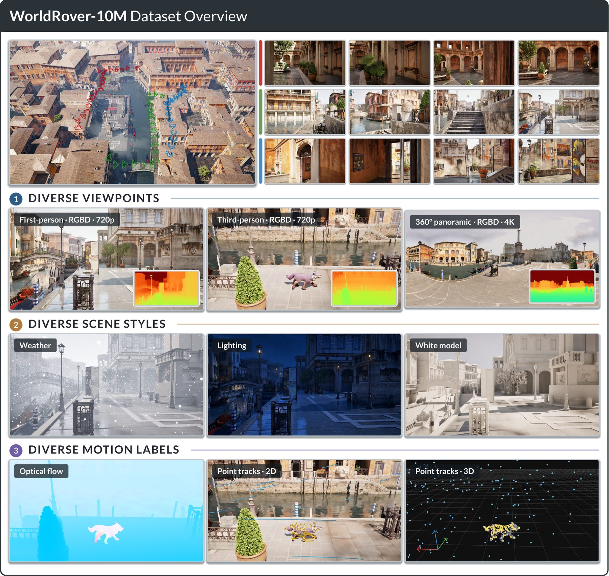

<h1 align="center">WorldRover</h1>
<p align="center"><b>A Scalable Synthetic Video Data Engine for World Exploration with Rich Annotations</b></p>

<p align="center">
  Xiaojie Xu<sup>1,2,*</sup> &nbsp; Zhengyuan Lin<sup>1,2,*</sup> &nbsp; Runyi Li<sup>1,2</sup> &nbsp;
  Yihao Liu<sup>1</sup> &nbsp; Kaipeng Zhang<sup>1,3,†</sup> &nbsp; Yongtao Ge<sup>1,†</sup>
</p>

<p align="center">
  <a href="https://arxiv.org/abs/2608.15659"><b>Paper</b></a> ·
  <a href="https://alayalab.github.io/WorldRover/"><b>Project page</b></a> ·
  <a href="https://huggingface.co/collections/xjxu21/worldrover-6a851193b19350ca6de9f424"><b>Dataset</b></a> ·
  <a href="tools/"><b>Tools</b></a>
</p>

<p align="center">
  
</p>

## What this is

WorldRover is a data engine that walks a camera — and optionally a character — through
artist-built 3D environments and records the traversal as video **together with the
annotations that a renderer can produce exactly**, rather than estimate afterwards: metric
depth, per-frame camera pose, optical flow, and the action stream that produced the motion.

Five axes of variation come out of the same engine:

| | |
|---|---|
| **Multi-view** | Three observations of a route with matched timing and geometry — first person, third person, 360 panorama |
| **Multi-modal** | Colour, depth and motion from one rasterization of the same instant |
| **Multi-style** | Geometry and motion held fixed while illumination or texture changes |
| **Multi-scene** | 30+ artist-built Unreal Engine scenes, interior to city scale |
| **Multi-character** | 70+ animated humanoids, animals and creatures |

Because the camera path is a first-class input, the same trajectory can be re-rendered in a
different projection, a different lighting state, or with a different character, and the
frames still line up frame for frame.

## The released dataset

The first public release is the **paired panoramic / first-person** slice: four scenes, about
30 min of each view per scene, **~4.1 h of video** at 30 fps.

| Scene | Clips per view | Per view | With depth |
|---|---|---|---|
| [med_village](https://huggingface.co/datasets/xjxu21/WorldRover-med_village) | 13 | 32.1 min | 286 GB |
| [paris](https://huggingface.co/datasets/xjxu21/WorldRover-paris) | 23 | 30.7 min | 167 GB |
| [venice](https://huggingface.co/datasets/xjxu21/WorldRover-venice) | 46 | 30.5 min | 169 GB |
| [art_nouveau](https://huggingface.co/datasets/xjxu21/WorldRover-art_nouveau) | 47 | 30.2 min | 179 GB |

Start from the **[lite subset](https://huggingface.co/datasets/xjxu21/WorldRover)** — RGB,
camera pose, actions and metadata, ~103 GB — and pull the per-scene repositories only for the
scenes whose lossless depth you need (depth is 87% of the bytes).

Every clip, both views, ships:

```
<scene>/{pano,fp}/<clip_id>/
  rgb.mp4                    H.264 30 fps, sRGB;  pano 4096x2048 equirect,  fp 1280x720 pinhole
  depth/depth.mkv            FFV1 lossless 16-bit, log-quantized radial distance
  depth/depth.meta.json      near/far, frame count, decode formula
  camera_trajectory.csv      per-frame pose (cm, deg) + intrinsics
  description.json           scene identity, asset pack + license, trajectory summary
  gamepad_format/            action labels (axes normalized to [-1, 1])
  trajectory.png             top-down path preview
```

**The two views of a clip id are the same camera path, frame for frame.** The first-person
clip was rendered from the panoramic clip's own per-frame trajectory, and the two pose files
agree to **0.000000 cm / deg** — not merely within a tolerance. Verify it yourself:

```bash
python tools/scripts/check_pairing.py /data/WorldRover/venice
```

Clips are 35 s to 3.5 min of continuous motion — no cuts, no teleports.

## Dataset tools

`tools/` holds the dataset-side Python package and scripts: reading clips, decoding depth,
camera geometry, verifying a download, and visualising trajectories and point clouds.

```bash
pip install -r tools/requirements.txt
python tools/scripts/verify_dataset.py /data/WorldRover --check-actions
```

```python
from worldrover import Clip                      # with tools/ on PYTHONPATH
clip = Clip("venice/fp/venice_000003")
rgb     = clip.rgb_frame(100)                    # uint8 (720, 1280, 3), sRGB
depth_m = clip.depth_frame(100)                  # planar depth in metres
points  = clip.points_world(100)                 # world points in centimetres
```

Three conventions are easy to get wrong by hand, and the tools handle all three: depth codes
are **log-quantized** and store **radial** distance (convert before unprojecting);
`camera_trajectory.csv` has `n_frames + 1` rows, the last being the closing keyframe; poses
are Unreal-style — left-handed, centimetres, X-forward / Y-right / Z-up, camera looking down
its own +X. See [`tools/README.md`](tools/README.md) and `tools/docs/` for the full format,
camera model and pairing notes.

The renderer and trajectory planner are **not** part of this release.

## Project page

This repository also serves the project page at
**https://alayalab.github.io/WorldRover/** (`index.html` + `static/`).

```bash
python3 -m http.server 8765     # then open http://localhost:8765
```

## Citation

```bibtex
@article{worldrover2026,
  title         = {WorldRover: A Scalable Synthetic Video Data Engine
                   for World Exploration with Rich Annotations},
  author        = {Xu, Xiaojie and Lin, Zhengyuan and Li, Runyi and
                   Liu, Yihao and Zhang, Kaipeng and Ge, Yongtao},
  journal       = {arXiv preprint arXiv:2608.15659},
  year          = {2026},
  eprint        = {2608.15659},
  archivePrefix = {arXiv},
  url           = {https://arxiv.org/abs/2608.15659}
}
```

## License

The dataset's rendered video, depth, camera pose and action labels are released for research
use; the underlying 3D environments are third-party commercial assets, are **not**
redistributed, and each clip's `description.json` records its asset pack and license. The
tools in `tools/` are MIT licensed (`tools/LICENSE`).
